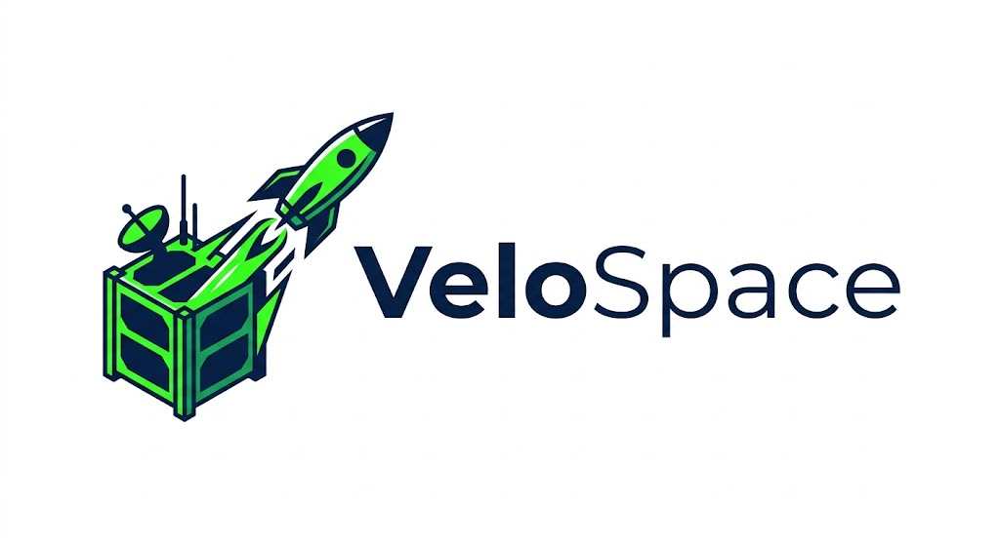
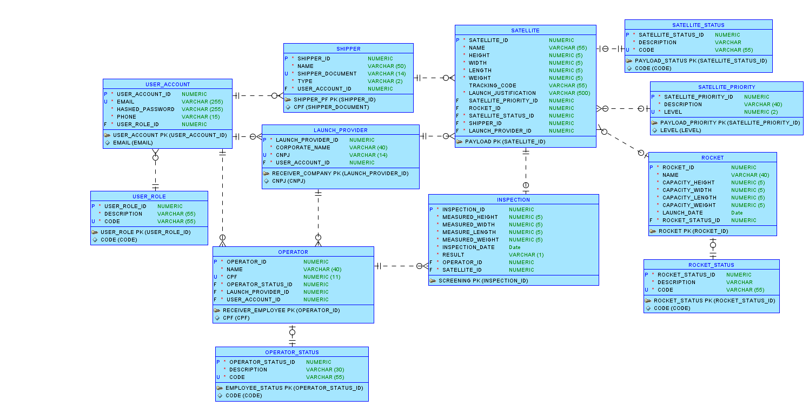
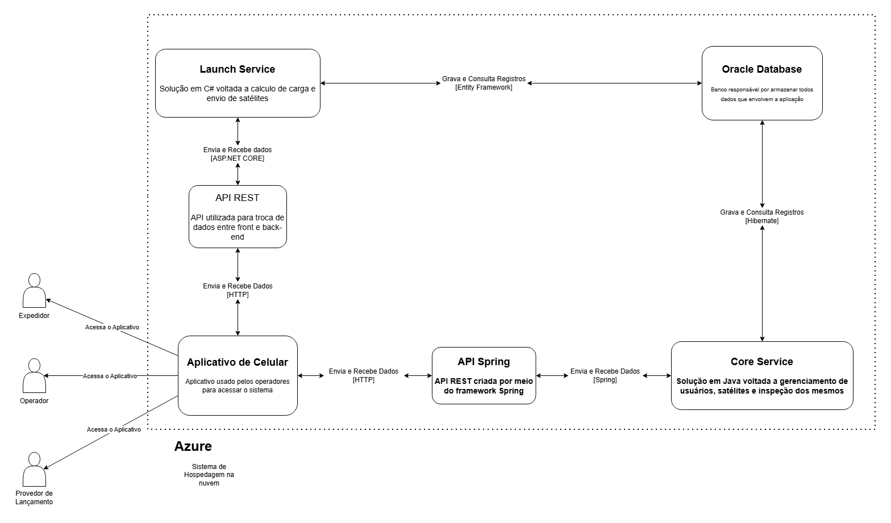

# VeloSpace: Plataforma de Gestão e Validação de CubeSats

## Definição do Projeto

### O que é o VeloSpace?

O **VeloSpace** é uma plataforma digital desenvolvida para conectar proprietários de **CubeSats**, como universidades, instituições de pesquisa e desenvolvedores independentes, a empresas fornecedoras de serviços de lançamento espacial.

O projeto surgiu da necessidade de reduzir a burocracia e a dificuldade encontradas por organizações que desejam colocar pequenos satélites em órbita, aproveitando oportunidades de lançamento frequentemente subutilizadas pelas empresas do setor aeroespacial.

A proposta do VeloSpace é tornar o processo de candidatura, seleção, rastreabilidade e validação de CubeSats mais **digital, transparente, seguro e eficiente**.

---

## 1. Visão geral

A **VeloSpace IA API** é uma API desenvolvida em **Python** com **Flask**, responsável por fornecer uma funcionalidade de inteligência artificial para o projeto **VeloSpace**.

A proposta dessa API é analisar dados técnicos de satélites, foguetes e inspeções para retornar uma **classificação preditiva** sobre a possibilidade de aprovação de um CubeSat para lançamento.

A classificação retornada pelo modelo indica se, para determinado conjunto de informações técnicas, o satélite tende a ser:

- **aprovado**
- **reprovado**

Essa API faz parte da camada inteligente do projeto VeloSpace e tem como objetivo apoiar a tomada de decisão durante o processo de validação, inspeção e preparação de satélites para lançamento.

---

## 2. Problema de IA que o projeto resolve

O problema de IA definido para este projeto é a **classificação preditiva da aprovação de satélites para lançamento**.

Na prática, o sistema busca responder perguntas como:

- este satélite tem chance de ser aprovado na inspeção?
- as medidas cadastradas são compatíveis com as medidas verificadas?
- o satélite está dentro da capacidade suportada pelo foguete?
- existe risco técnico de reprovação antes do lançamento?

Esse problema é relevante porque, no contexto de lançamento de CubeSats, inconsistências dimensionais ou excesso de peso podem impedir o envio do satélite, gerar atrasos operacionais e prejudicar o aproveitamento da oportunidade de lançamento.

A IA foi proposta para atuar como um mecanismo de apoio à inspeção, utilizando dados técnicos já existentes no sistema para prever se um satélite tende a ser aprovado ou reprovado.

---

## 3. Como a IA será usada dentro do sistema

A IA será utilizada como um serviço de apoio à decisão para operadores e provedores de lançamento.

O fluxo geral é o seguinte:

1. o cliente cadastra um satélite no sistema;
2. o satélite é associado a uma oportunidade ou foguete;
3. a equipe de operação realiza a inspeção física;
4. a API recebe os dados cadastrados, os dados medidos e as capacidades do foguete;
5. esses dados são organizados no formato esperado pelo modelo;
6. o modelo de IA realiza a predição;
7. a API retorna a classificação final, a probabilidade de aprovação, o nível de risco e o motivo provável.

Com isso, o sistema consegue informar ao usuário se aquele satélite apresenta:

- baixa chance de reprovação;
- risco médio de reprovação;
- alto risco de reprovação.

---

## 4. Componentes-chave do projeto

Os principais componentes desta solução são:

### 4.1 API Flask

A API foi desenvolvida em **Python** com **Flask** e é responsável por:

- expor os endpoints HTTP;
- receber requisições em JSON;
- montar as features calculadas;
- executar a predição com o modelo treinado;
- devolver a resposta ao cliente em formato JSON.

### 4.2 Modelo de IA

O modelo utilizado é um **modelo de classificação supervisionada**, treinado com dados sintéticos em formato CSV.

Esse modelo foi exportado em arquivo `.pkl` e é carregado pela API no momento da inicialização.

A saída do modelo indica se o satélite tende a ser:

- `A` para aprovado;
- `R` para reprovado.

### 4.3 Dataset sintético

Para o treinamento inicial, foi utilizado um dataset sintético com dados simulados de satélites, inspeções e foguetes.

Esse dataset representa cenários variados, incluindo:

- satélites dentro da capacidade do foguete;
- satélites com peso acima do permitido;
- satélites com medidas divergentes em relação ao cadastro;
- foguetes com status problemático;
- satélites com status pendente ou inconsistente.

### 4.4 Camada de predição

Essa camada transforma os dados enviados no JSON em um `DataFrame` compatível com o modelo treinado.

Além disso, a API calcula automaticamente colunas derivadas, como diferenças entre medidas cadastradas e medidas inspecionadas, além das margens em relação à capacidade do foguete.

---

## 5. Modelo de IA escolhido e justificativa

O modelo escolhido para a solução foi um **modelo de classificação supervisionada**.

Para o protótipo acadêmico, uma boa escolha é o **Random Forest Classifier**, pois ele funciona bem com dados tabulares e permite classificar os registros em aprovado ou reprovado.

### Justificativa da escolha

O modelo foi escolhido porque:

- é adequado para problemas de classificação;
- funciona bem com dados numéricos e tabulares;
- permite trabalhar com várias features técnicas;
- consegue retornar probabilidade de aprovação quando utilizado com `predict_proba`;
- é relativamente simples de explicar em contexto acadêmico;
- é mais robusto que uma árvore de decisão simples, pois combina várias árvores para melhorar a predição.

O objetivo do modelo não é controlar o lançamento de forma automática, mas sim apoiar a análise técnica feita pelos operadores do sistema.

Nesse cenário, o modelo atende bem como uma solução inicial de inteligência artificial para o VeloSpace.

---

## 6. Dados utilizados pela IA

A IA utiliza dados relacionados ao satélite, à inspeção e ao foguete.

As informações usadas como entrada foram definidas a partir do modelo de dados do VeloSpace.

### Features utilizadas pelo modelo

- `height`
- `width`
- `length`
- `weight`
- `measured_height`
- `measured_width`
- `measured_length`
- `measured_weight`
- `capacity_height`
- `capacity_width`
- `capacity_length`
- `capacity_weight`
- `satellite_priority_id`
- `satellite_status_id`
- `rocket_status_id`
- `height_difference`
- `width_difference`
- `length_difference`
- `weight_difference`
- `height_margin`
- `width_margin`
- `length_margin`
- `weight_margin`

### Origem dos dados

Essas informações são obtidas conceitualmente a partir das tabelas:

- `VS_SATELLITE`
- `VS_INSPECTION`
- `VS_ROCKET`
- `VS_SATELLITE_PRIORITY`
- `VS_SATELLITE_STATUS`
- `VS_ROCKET_STATUS`

### Saída do modelo

A saída do modelo representa a classificação prevista para o satélite:

- `A` = aprovado
- `R` = reprovado

A API também pode retornar informações complementares, como:

- probabilidade de aprovação;
- nível de risco;
- motivo provável da aprovação ou reprovação.

---

## 7. Formato e quantidade mínima de dados para treinamento

Para o treinamento inicial do modelo foi utilizado um **CSV com dados sintéticos**.

Cada linha do CSV representa a situação de:

**um satélite sendo avaliado para lançamento em relação às suas medidas, inspeção e capacidade do foguete**

### Exemplo de linha do dataset

```csv
height,width,length,weight,measured_height,measured_width,measured_length,measured_weight,capacity_height,capacity_width,capacity_length,capacity_weight,satellite_priority_id,satellite_status_id,rocket_status_id,height_difference,width_difference,length_difference,weight_difference,height_margin,width_margin,length_margin,weight_margin,result
10,10,20,5,10,11,20,5,15,15,25,10,1,1,1,0,1,0,0,5,4,5,5,A
```

### Quantidade mínima necessária

Para um protótipo acadêmico, é possível iniciar com algumas centenas de registros sintéticos.

No entanto, para obter resultados mais consistentes, o ideal é ter:

- exemplos variados de satélites aprovados;
- exemplos variados de satélites reprovados;
- diferentes capacidades de foguetes;
- diferentes status de satélite;
- diferentes status de foguete;
- casos com pequenas e grandes divergências nas medições;
- dados balanceados entre aprovação e reprovação.

Quanto maior e mais realista for o conjunto de dados, melhor tende a ser o comportamento do modelo.

---

## 8. Fluxo de dados do sistema

O fluxo de dados desta solução ocorre da seguinte forma:

1. a aplicação faz uma requisição para a API;
2. a API recebe os dados técnicos do satélite, inspeção e foguete;
3. os dados são convertidos em um `DataFrame`;
4. a API calcula as features derivadas;
5. as colunas são organizadas na mesma ordem usada no treinamento;
6. o modelo processa os dados;
7. a API retorna a classificação para o cliente.

---

## 9. Fluxo de funcionamento da IA dentro do sistema

Quando a funcionalidade de predição é acionada, o comportamento esperado é:

1. o operador ou sistema solicita a análise de aprovação de um satélite;
2. a API recebe os dados via endpoint `/predict`;
3. as medidas cadastradas são comparadas com as medidas da inspeção;
4. as medidas da inspeção são comparadas com as capacidades do foguete;
5. o sistema calcula margens e diferenças;
6. os dados são organizados em um `DataFrame` com a mesma estrutura usada no treinamento;
7. o modelo executa a classificação;
8. a API devolve a predição ao sistema cliente;
9. o sistema pode usar essa resposta para exibir alertas, relatórios ou recomendações operacionais.

---

## 10. Diagrama simples de comunicação

```text
[Cliente / Sistema]
        |
        v
[VeloSpace IA API - Flask]
        |
        +--> [Tratamento dos dados]
        |         |
        |         +--> Diferenças entre cadastro e inspeção
        |         +--> Margens entre inspeção e capacidade do foguete
        |
        v
[Modelo de Classificação (.pkl)]
        |
        v
[Resposta da predição]
```

---

## 11. Endpoints principais da API

| Método | Endpoint | Descrição | Corpo da requisição | Resposta esperada |
|---|---|---|---|---|
| `GET` | `/` | Retorna uma mensagem inicial da API e informa o endpoint principal. | Não possui corpo. | JSON com mensagem da API e rota `/predict`. |
| `GET` | `/health` | Verifica se a API está online e se o modelo foi carregado. | Não possui corpo. | JSON com status da API e indicação se o modelo está carregado. |
| `POST` | `/predict` | Recebe as features do satélite, inspeção e foguete, calcula colunas derivadas e executa a predição. | JSON com todas as colunas esperadas pela API. | JSON com classificação, probabilidade, nível de risco e motivo provável. |

### Exemplo de corpo da requisição

#### `POST /predict`

```json
{
  "height": 10,
  "width": 10,
  "length": 20,
  "weight": 5,
  "measured_height": 10,
  "measured_width": 11,
  "measured_length": 20,
  "measured_weight": 5,
  "capacity_height": 15,
  "capacity_width": 15,
  "capacity_length": 25,
  "capacity_weight": 10,
  "satellite_priority_id": 1,
  "satellite_status_id": 1,
  "rocket_status_id": 1
}
```

### Exemplo de resposta

#### `GET /health`

```json
{
  "status": "ok",
  "model_loaded": true
}
```

#### `POST /predict`

```json
{
  "total_predictions": 1,
  "results": [
    {
      "prediction": "A",
      "prediction_label": "APPROVED",
      "approval_probability": 0.91,
      "risk_level": "LOW",
      "main_reason": "O satélite está dentro das dimensões e peso suportados pelo foguete."
    }
  ]
}
```

### Exemplo de predição em lote

O endpoint `/predict` também pode receber uma lista de objetos.

```json
[
  {
    "height": 10,
    "width": 10,
    "length": 20,
    "weight": 5,
    "measured_height": 10,
    "measured_width": 11,
    "measured_length": 20,
    "measured_weight": 5,
    "capacity_height": 15,
    "capacity_width": 15,
    "capacity_length": 25,
    "capacity_weight": 10,
    "satellite_priority_id": 1,
    "satellite_status_id": 1,
    "rocket_status_id": 1
  },
  {
    "height": 12,
    "width": 12,
    "length": 25,
    "weight": 15,
    "measured_height": 12,
    "measured_width": 12,
    "measured_length": 25,
    "measured_weight": 18,
    "capacity_height": 20,
    "capacity_width": 20,
    "capacity_length": 40,
    "capacity_weight": 10,
    "satellite_priority_id": 2,
    "satellite_status_id": 1,
    "rocket_status_id": 1
  }
]
```

---

## 12. Tecnologias utilizadas

As principais tecnologias utilizadas neste projeto são:

- **Python**
- **Flask**
- **Pandas**
- **Pickle**
- **NumPy**
- **scikit-learn**

---

## 13. Estrutura esperada do projeto

```text
velospace-ia-api/
│
├── inference.py
├── modelo.pkl
├── requirements.txt
├── velospace_satellite_approval_dataset.csv
└── README.md
```

---

## 14. Como executar a API

### Instalação das dependências

```bash
pip install -r requirements.txt
```

Ou, manualmente:

```bash
pip install flask pandas scikit-learn numpy
```

### Execução

```bash
python inference.py
```

A API será iniciada em:

```text
http://localhost:8000
```

---

## 15. Exemplo de uso

### Teste de saúde da API

```http
GET /health
```

### Teste de predição com payload completo

```http
POST /predict
Content-Type: application/json
```

```json
{
  "height": 10,
  "width": 10,
  "length": 20,
  "weight": 5,
  "measured_height": 10,
  "measured_width": 11,
  "measured_length": 20,
  "measured_weight": 5,
  "capacity_height": 15,
  "capacity_width": 15,
  "capacity_length": 25,
  "capacity_weight": 10,
  "satellite_priority_id": 1,
  "satellite_status_id": 1,
  "rocket_status_id": 1
}
```

### Teste de predição em lote

```http
POST /predict
Content-Type: application/json
```

```json
[
  {
    "height": 10,
    "width": 10,
    "length": 20,
    "weight": 5,
    "measured_height": 10,
    "measured_width": 11,
    "measured_length": 20,
    "measured_weight": 5,
    "capacity_height": 15,
    "capacity_width": 15,
    "capacity_length": 25,
    "capacity_weight": 10,
    "satellite_priority_id": 1,
    "satellite_status_id": 1,
    "rocket_status_id": 1
  },
  {
    "height": 30,
    "width": 15,
    "length": 40,
    "weight": 8,
    "measured_height": 35,
    "measured_width": 15,
    "measured_length": 40,
    "measured_weight": 8,
    "capacity_height": 28,
    "capacity_width": 20,
    "capacity_length": 50,
    "capacity_weight": 20,
    "satellite_priority_id": 1,
    "satellite_status_id": 1,
    "rocket_status_id": 1
  }
]
```

---

## 16. Benefícios esperados da solução

Com essa API, o projeto VeloSpace passa a contar com uma camada de análise preditiva capaz de:

- identificar antecipadamente satélites com risco de reprovação;
- apoiar o operador durante o processo de inspeção;
- reduzir retrabalho na validação técnica;
- melhorar o aproveitamento das oportunidades de lançamento;
- aumentar a confiabilidade do processo de seleção e preparação de CubeSats;
- fornecer uma justificativa técnica para a classificação do modelo;
- auxiliar na tomada de decisão antes do envio final para lançamento.

---

## 17. Limitações atuais

Por se tratar de um protótipo inicial, esta solução ainda possui algumas limitações, como:

- uso de dados sintéticos para treinamento;
- necessidade de evolução para dados reais de inspeções;
- dependência da qualidade das informações cadastradas no sistema;
- ausência de integração direta com o banco no endpoint atual;
- possibilidade de o modelo aprender padrões artificiais do dataset sintético;
- necessidade de validação com especialistas do domínio espacial;
- ausência, neste momento, de uma camada mais robusta de autenticação e segurança.

---

## 🗃️ Diagrama de Entidade-Relacionamento (DER)

<div align="center">
  
</div>

---

## Diagrama de Arquitetura
<div align="center">
  
</div>

---

## 18. Considerações finais

A **VeloSpace IA API** foi projetada como uma camada preditiva de apoio à validação técnica de satélites.

Sua principal função é transformar dados operacionais do sistema VeloSpace em uma resposta inteligente, capaz de indicar se um CubeSat possui maior tendência de aprovação ou reprovação no processo de inspeção para lançamento.

Mesmo sendo um protótipo inicial, a solução já demonstra de forma clara:

- a definição de um problema real de IA;
- a escolha e justificativa de um modelo de classificação;
- a identificação dos dados necessários;
- a criação de features derivadas;
- a execução de predição via API;
- a possibilidade de integração com outras camadas do sistema.

Como evolução futura, o projeto pode incorporar:

- dados reais em vez de sintéticos;
- integração direta com o banco Oracle;
- endpoint de predição por `satellite_id`;
- dashboards de risco dos satélites;
- comparação automática entre satélite e foguete;
- recomendação de foguetes compatíveis;
- melhoria no balanceamento das classes;
- novos modelos de classificação.
